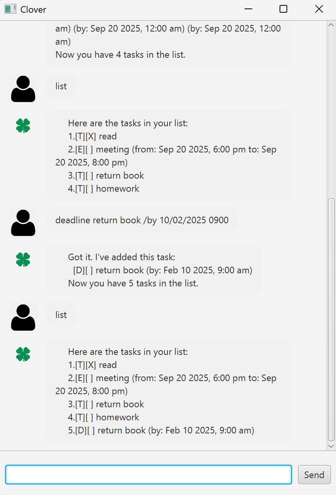

# Clover User Guide



Clover is a friendly JavaFX chatbot that helps you manage your tasks. You can add Todos, Deadlines, and Events, mark them as done, search, delete, and even get reminders for upcoming tasks. All tasks are saved automatically so you can pick up where you left off.

---

## Quick Start
1. Ensure you have **Java 17** or later installed.  
2. Download the latest JAR file from the Releases page of this repo.  
3. Run the program:
4. You’ll see a greeting from Clover. Start typing commands!

---

## Features

### Add a ToDo
Adds a simple task without a date/time.  
Example: 'todo Buy milk'
Expected outcome: 

Got it. I've added this task:
[T][ ] Buy milk
 ```


### Add a Deadline
Adds a task with a specific due date/time.  
Example:
deadline return book /by 2025-09-20 1800

Expected outcome:
 ```
Got it. I've added this task:
[D][ ] return book (by: Sep 20 2025, 6:00 PM)
 ```

### Add an Event
Adds a task that spans a period of time.  
Example:
event project meeting /from 2025-09-20 1400 /to 2025-09-20 1600

Expected outcome:
 ```
Got it. I've added this task:
[E][ ] project meeting (from: Sep 20 2025, 2:00 PM to: Sep 20 2025, 4:00 PM)
 ```

### List Tasks
Shows all current tasks.  
Example:
list

Expected outcome:
 ```
Here are the tasks in your list:

1.[T][ ] Buy milk
2.[D][ ] return book (by: Sep 20 2025, 6:00 PM)
 ```

### Mark / Unmark Tasks
Marks a task as done or undone.  
Examples:
mark 2
unmark 2

Expected outcome:
 ```
Nice! I've marked this task as done:
[D][X] return book (by: Sep 20 2025, 6:00 PM)
 ```

### Delete Tasks
Removes a task from the list.  
Example:
delete 1

Expected outcome:
 ```
Okay, I've removed this task:
[T][ ] Buy milk
 ```


### Find Tasks
Searches for tasks containing a keyword.  
Example:
find book


Expected outcome:
 ```
Here are the matching tasks in your list:

[D][ ] return book (by: Sep 20 2025, 6:00 PM)
 ```

### Reminders
Shows tasks due within the next N days (default = 1).  
Example:
remind 3


Expected outcome:
 ```
You need to do these tasks within 3 day(s):
2. [D][ ] return book (by: Sep 20 2025, 6:00 PM)
 ```


### Exit
Closes the application.  
Example:
bye

Expected outcome:
 ```
Bye, hope to see you again soon!!
 ```
